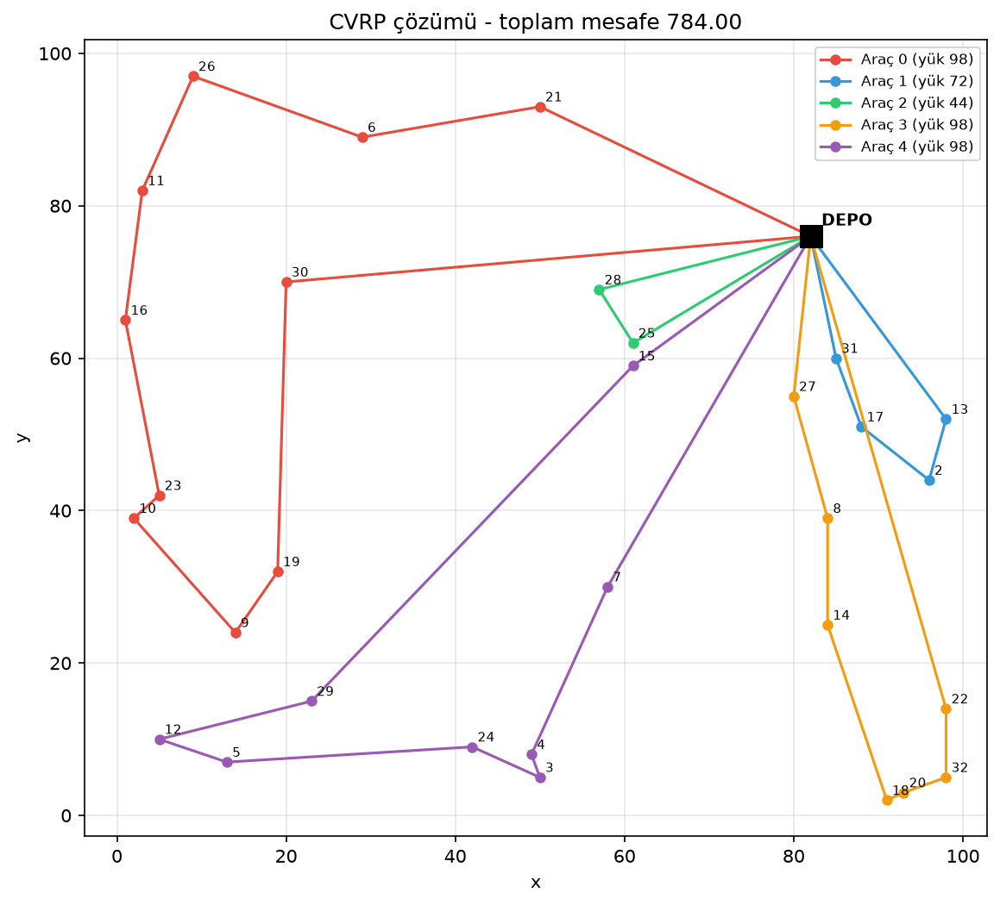
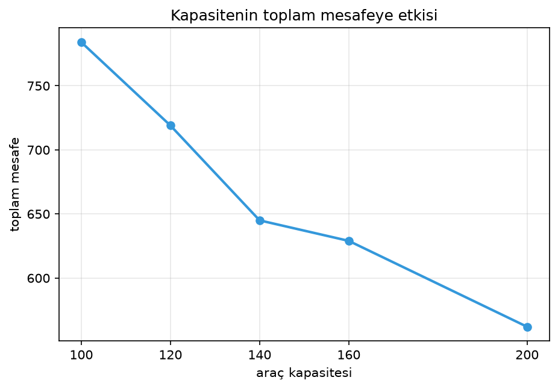
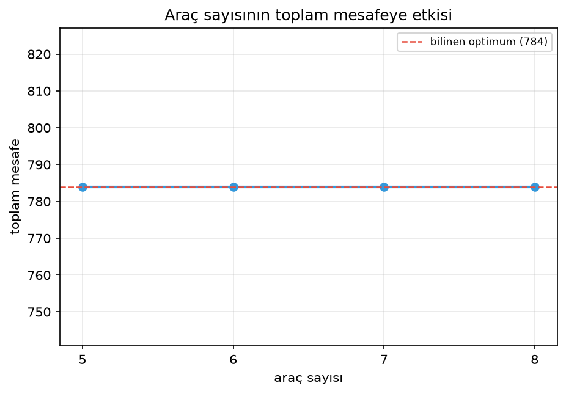
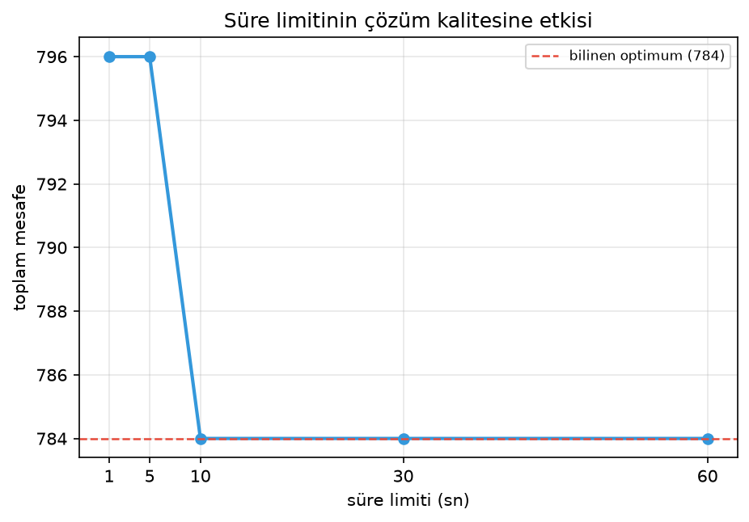
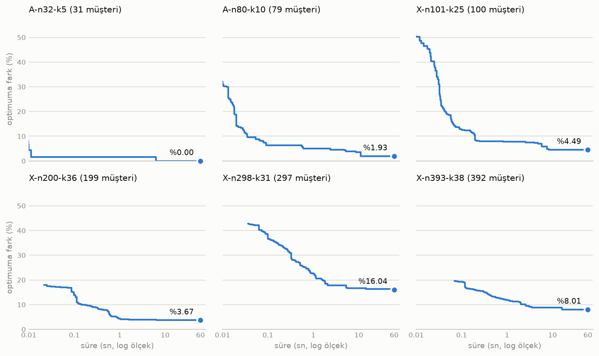

# CVRP Solver

Kapasiteli araç rotalama problemini (CVRP) Google OR-Tools ile çözdüğüm bir
proje. Çözücüyü optimumu bilinen bir benchmark örneğinde test ettim, sonra araç
sayısı, kapasite ve süre limitinin sonucu nasıl etkilediğine baktım. Son olarak
aynı yöntemi 392 müşteriye kadar büyüyen örneklerde deneyip optimumdan ne kadar
uzaklaştığını ölçtüm.

## Problem

Bir depo ve n müşteri var, her müşterinin belli bir talebi var. Aynı
kapasitedeki K araç depodan çıkıp müşterileri dolaşıyor ve depoya geri dönüyor.

- Her müşteriye tam bir kez gidilmeli
- Hiçbir araç kapasitesinden fazla yük taşıyamaz
- Amaç toplam mesafeyi en aza indirmek

## Veri

Augerat et al. (1995) Set A'dan **A-n32-k5** örneğini kullandım.

| Özellik             | Değer                                  |
| ------------------- | -------------------------------------- |
| Düğüm sayısı        | 32 (1 depo + 31 müşteri)               |
| Araç kapasitesi     | 100                                    |
| Toplam talep        | 410                                    |
| Minimum araç sayısı | 5                                      |
| Sıkılık (410 / 500) | 0.82                                   |
| Mesafe              | Öklid, tam sayıya yuvarlanmış (EUC_2D) |
| Bilinen optimum     | 784                                    |

Toplam talep 410 ve her araç en fazla 100 taşıyabildiği için en az 5 araç
gerekiyor. 5 araçla ortalama doluluk %82 oluyor, yani kapasite kısıtı oldukça
sıkı.

## Sonuç

5 araç ve 30 saniyelik süre limitiyle çözücü 784'ü buldu:

- Toplam mesafe: **784** (bilinen optimum 784, fark %0.00)
- Kullanılan araç: 5 / 5
- En dolu araç: 98 / 100

784'ün optimal olduğu literatürde kanıtlanmış, dolayısıyla bulunan çözüm de
optimal. Rotalar da CVRPLIB'de yayımlanan optimal çözümle
([data/A-n32-k5.sol](data/A-n32-k5.sol)) birebir aynı.



## Duyarlılık analizi

Her denemede tek bir parametreyi değiştirip diğerlerini sabit tuttum (kapasite
100, 5 araç, 30 sn).

### Kapasite

| Kapasite | Mesafe | 100'e göre azalma | Kullanılan araç | Min. araç | Maks. yük |
| -------- | ------ | ----------------- | --------------- | --------- | --------- |
| 100      | 784    | -                 | 5               | 5         | 98        |
| 120      | 719    | %8.29             | 4               | 4         | 115       |
| 140      | 645    | %17.73            | 3               | 3         | 138       |
| 160      | 629    | %19.77            | 3               | 3         | 158       |
| 200      | 562    | %28.32            | 3               | 3         | 195       |



Min. araç, talebi taşımak için gereken en az araç sayısı (410 / kapasite,
yukarı yuvarlanmış). 784 sadece kapasite 100 için geçerli, kapasite değişince
ortada farklı bir problem oluyor. Bu yüzden tabloya optimuma fark yerine
kapasite 100'e göre azalmayı yazdım. Diğer kapasitelerin bilinen bir optimumu
yok, buradaki değerler çözücünün 30 saniyede bulabildiği en iyi çözümler.

Mesafedeki büyük düşüşler araç sayısının azaldığı adımlarda geliyor. Kapasite
100'den 140'a çıkınca araç sayısı 5'ten 3'e iniyor ve mesafe %17.7 kısalıyor.
Çözücü her kapasitede tam minimum sayıda araç kullanıyor.

140'tan sonra araç sayısı 3'te sabit kalıyor (200 kapasiteyle bile 2 araç
yetmiyor, 2 x 200 = 400) ama mesafe düşmeye devam ediyor: 645'ten 562'ye, %12.9
daha. Kapasite gevşeyince müşteriler daha mantıklı gruplanabiliyor. Düşüş
düzenli de değil. Kapasitedeki her 1 birimlik artış mesafeyi 140-160 arasında
ortalama 0.8, 160-200 arasında ise 1.7 azaltıyor. İlk bakışta azalan getiri
bekliyordum ama veri öyle demiyor.

### Araç sayısı

| Araç | Mesafe    | Kullanılan araç |
| ---- | --------- | --------------- |
| 4    | çözüm yok | -               |
| 5    | 784       | 5               |
| 6    | 784       | 5               |
| 7    | 784       | 5               |
| 8    | 784       | 5               |



4 araçla çözüm yok, çünkü 4 x 100 = 400 ve toplam talep 410. 5'ten fazla araç
verince fazlası hiç kullanılmıyor. Her ek araç depoya bir gidiş-dönüş daha
demek, o yüzden çözücü onları boş bırakıyor.

Fazla araç sonucu değiştirmiyor ama aramayı yavaşlatıyor. 5 araçla optimuma 5-7
saniyede ulaşılıyor, 8 araçla 20 saniye civarında. Boş araçlar arama
uzayını büyütüyor. Başta süre limitini 10 saniye tutmuştum ve 8 araçlı model
796'da kalıyordu, limiti bu yüzden 30 saniyeye çıkardım.

### Süre limiti

| Süre (sn) | Mesafe | Optimuma fark |
| --------- | ------ | ------------- |
| 1         | 796    | %1.53         |
| 5         | 796    | %1.53         |
| 10        | 784    | %0.00         |
| 30        | 784    | %0.00         |
| 60        | 784    | %0.00         |



Çözücü 796'yı daha ilk saniyede buluyor ve birkaç saniye orada takılı kalıyor.
Guided Local Search'ün ceza mekanizması sonunda aramayı oradan çıkarıyor ve
784'e çalıştırmaya göre 5 ile 7 saniye arasında ulaşıyor. Bunu her iyileşmenin
zamanını solution callback ile kaydederek ölçtüm.

Süre limiti gerçek saate göre işlediği için 10 saniye bu eşiğe çok yakın. Aynı
ayar bir çalıştırmada 796 verdi, daha yavaş bir makinede de farklı sonuç
çıkabilir.

Şunu da not edeyim: metasezgisel bir yöntem optimumu bulsa bile optimum
olduğunu kanıtlayamaz. 784'ün optimal olduğunu literatürden biliyoruz. Kanıt
gerekiyorsa CP-SAT veya MIP gibi tam bir yöntem lazım. Problem büyüyünce ne
olduğuna bir sonraki bölümde baktım.

## Büyük örnekler

A-n32-k5 küçük bir örnek ve orada optimumu bulmak tek başına çok şey söylemiyor.
O yüzden aynı çözücüyü CVRPLIB'den seçtiğim, optimumu kanıtlanmış daha büyük
örneklerde denedim: A setinden 32 ve 80 düğümlü iki örnek, X setinden (Uchoa et
al., 2017) 101 ile 393 düğüm arası dört örnek. Her örneği bir kez 60 saniye çözüp
her iyileşmenin zamanını kaydettim. 1, 10 ve 30 saniye sütunları bu tek
çalıştırmadan okunuyor. Tablodaki değerler optimuma fark.

| Örnek      | Müşteri | Filo | 1 sn   | 10 sn  | 30 sn  | 60 sn  | Son iyileşme |
| ---------- | ------- | ---- | ------ | ------ | ------ | ------ | ------------ |
| A-n32-k5   | 31      | 5    | %1.53  | %0.00  | %0.00  | %0.00  | 6 sn         |
| A-n80-k10  | 79      | 10   | %4.93  | %3.52  | %1.93  | %1.93  | 11 sn        |
| X-n101-k25 | 100     | 26   | %7.77  | %4.52  | %4.52  | %4.49  | 51 sn        |
| X-n200-k36 | 199     | 38   | %4.33  | %3.70  | %3.67  | %3.67  | 29 sn        |
| X-n298-k31 | 297     | 31   | %22.70 | %16.65 | %16.27 | %16.04 | 53 sn        |
| X-n393-k38 | 392     | 39   | %11.88 | %8.84  | %8.01  | %8.01  | 17 sn        |



İki ayrı çalıştırmada 60 saniyelik sonuçlar birebir aynı çıktı, sadece saate bağlı
ara değerler biraz oynuyor.

Küçük A örneklerinde çözücü optimuma ulaşıyor ya da %2'nin altına iniyor. X
örneklerinde ise 60 saniye sonunda fark %3.7 ile %16 arasında kalıyor. A-n32-k5'teki
%0 büyük örneklere taşınmıyor.

Fark boyutla düzenli büyümüyor. 199 müşterili X-n200-k36, 100 müşterili
X-n101-k25'ten daha iyi sonuç veriyor ve en kötü sonuç en büyük örnekte değil,
297 müşterili X-n298-k31'de çıkıyor. X seti bilerek farklı depo konumları,
müşteri dağılımları ve talep yapılarıyla üretilmiş, yani bu örnekler sadece
boyutta ayrışmıyor. Altı örnekten "boyut iki katına çıkınca fark şu kadar artıyor"
gibi bir kural çıkarmak doğru olmaz.

İlerlemenin büyük kısmı ilk birkaç saniyede geliyor. 10 saniyeden 60 saniyeye
fark A-n80-k10 dışında her örnekte 1 puandan az kapanıyor. Son iyileşme bazı
örneklerde 50. saniyeyi geçse de bunlar küçük adımlar: X-n101-k25'te 30.
saniyeden sonra kazanılan fark sadece 0.03 puan. Arama belli bir noktadan sonra
tıkanıyor, bu örneklerde süreyi artırmak tek başına farkı kapatmıyor.

**Filo.** Her örnekte araç sayısını optimal çözümdeki rota sayısıyla başlattım.
X setinde araç sayısı serbest, adındaki k sadece alt sınır. Nitekim X-n101-k25'in
optimal çözümü 26 araç kullanıyor. X-n200-k36 ve X-n393-k38'de başlangıç
heuristic'i (`PATH_CHEAPEST_ARC`) bu kadar araçla uygun bir çözüm kuramadı ve
bütün süreyi harcayıp hiçbir şey döndürmedi. Bu yüzden benchmark önce 2
saniyelik kısa denemelerle filoyu çözüm kurulana kadar birer artırıyor, bu iki
örnekte filo 38 ve 39'a çıktı. X-n200-k36'da çözücü 37 araç kullandı, optimal
çözüm ise 36 araçlı.

## Yöntem

Çözüm iki adımdan oluşuyor:

1. `PATH_CHEAPEST_ARC` ile başlangıç çözümü: her adımda en yakın uygun müşteri
   eklenerek açgözlü bir rota kuruluyor.
2. `GUIDED_LOCAL_SEARCH` ile iyileştirme: başlangıç çözümü süre limiti dolana
   kadar yerel aramayla iyileştiriliyor. Arama bir yerel optimuma takılınca sık
   kullanılan arklar cezalandırılıyor ve arama başka bölgelere kayıyor. Bu
   yüzden süre bitmeden durmuyor.

Kapasite kısıtını OR-Tools'un dimension yapısıyla kurdum. Rota boyunca biriken
yük takip ediliyor ve araç kapasitesiyle sınırlanıyor.

**Alt-tur eliminasyonu.** Ark tabanlı bir MIP modelinde derece kısıtları tek
başına depoya bağlı olmayan kapalı döngüleri engellemiyor, o yüzden MTZ ya da
kapasite kesmeleri gibi ek kısıtlar gerekiyor. OR-Tools'ta buna gerek yok.
Rotalama modelinde her düğümün bir "sonraki düğüm" (`NextVar`) değişkeni var ve
motor, her aracın başlangıçtan bitişe döngüsüz bir yol izlemesini kendisi
sağlıyor.

**Mesafe hesabı.** Burada başta yanıldım. TSPLIB'in `EUC_2D` tanımında her
mesafe en yakın tam sayıya yuvarlanıyor ve 784 de bu kuralla hesaplanmış. İlk
versiyonda mesafeleri yuvarlamadan kullanmıştım, çözücü 787.08 bulmuştu ve
optimumdan %0.39 uzakta olduğumu düşünmüştüm. Aslında iki farklı problemi
karşılaştırıyormuşum. 784 maliyetli optimal rotaların yuvarlanmamış gerçek
uzunluğu 787.81, yani yuvarlamasız çözüm gerçek mesafede optimal rotalardan bile
kısaydı. İki kural farklı optimal rotalara götürüyor. Karşılaştırmak isterseniz
`build_distance_matrix(coords, rounded=False)` ile yuvarlamayı kapatabilirsiniz.

**Ölçekleme.** OR-Tools rotalama motoru sadece tam sayı maliyetlerle çalışıyor.
Çözücü mesafeleri 1000 ile çarpıp yuvarlıyor, raporlarken tekrar bölüyor.
Böylece yuvarlama kapalıyken de üç ondalık basamak korunuyor.

## Kurulum

```bash
python -m venv venv
source venv/bin/activate   # Windows: venv\Scripts\Activate.ps1
pip install -r requirements.txt
python main.py
```

Süre limitleri yüzünden tüm deneylerin bitmesi 7 dakika kadar sürüyor. Büyük
örneklerle karşılaştırma ayrı bir betik, o da 6-7 dakika sürüyor:

```bash
python benchmark.py
```

Çıktılar `results/` klasörüne yazılıyor.

## Dosyalar

- `data/`: benchmark örnekleri (.vrp) ve CVRPLIB'deki optimal çözümleri (.sol)
- `src/parser.py`: .vrp ve .sol dosyalarını okuma, mesafe matrisi
- `src/solver.py`: OR-Tools modeli
- `src/plot.py`: rota haritası
- `src/sensitivity.py`: parametre taramaları, tablolar, CSV ve grafikler
- `src/benchmark.py`: büyük örneklerde ölçüm, tablo ve grafik
- `main.py`: A-n32-k5 üzerindeki deneyleri çalıştırır
- `benchmark.py`: büyük örneklerle karşılaştırmayı çalıştırır
